# Inlämningsuppgift 1 i JavaScript intro

## Hej och välkommen till min README för JavaScript intro

Jag presenterar här med mitt projekt, G:s Donut Shop. (Gettruds Donut Shop)

Jag valde att gå för en clean design som både skall funka i desktop och mobile. Sidan är annpassad efter mobile-first. Jag ville att sidan skulle kännas lekfull och färgglad, då det trots allt är en Donut-butik :)  Fokus har legat på att webbshoppen skall vara enkel att navigera, tillgänglig, och anpassningsbar till olika enheter.    Tyvärr hann jag ej med att få dit en footer eller darkmode - då tiden ej fanns där. Jag prioriterade i första hand funktioner i JS vilket har varit en utmaning, men också väldigt roligt och inte minst lärorikt.   I och med att JS ska implementeras som ytterligare ett element i projekt så förstår jag hur otroligt viktigt det blir med ett bra och strukturerat HTML-träd.     Jag valde till en början att sammla all JavaScript kod i en och samma main-fil. Men när den blev över 1000-rader lång (Förmodligen inte opimal DRY-kodning), så valde jag att göra en mapp-struktur, likt mina tidigare projekt med SASS.   Detta var både hjälpsamt och en stor utmaning under projektets gång. Jag kommer in på detta under <b>"utmaningar".</b>

### Tech-stack:

- HTML5
- SCSS
- JavaScript (Vanilla)
- Vite
- GitHub

---

## Presentation av sidan

### Mobile Screenshots:

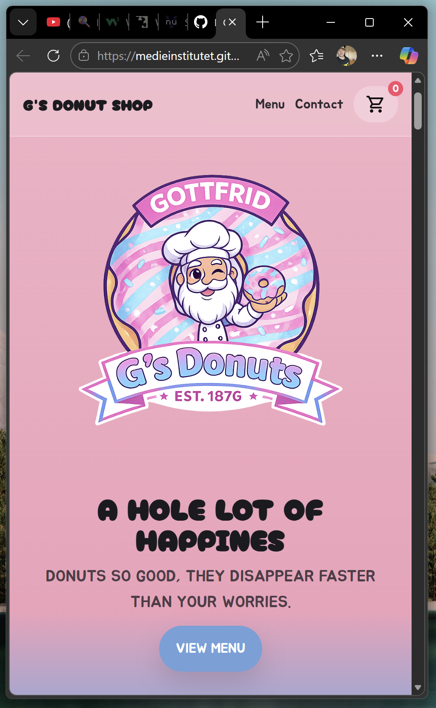

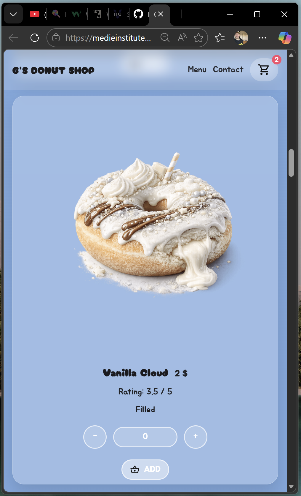

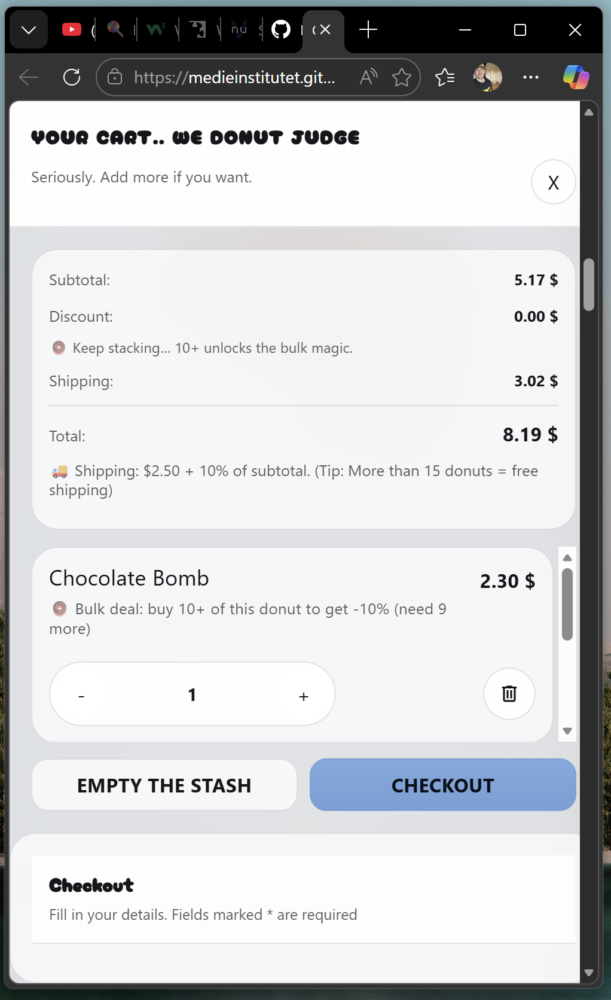

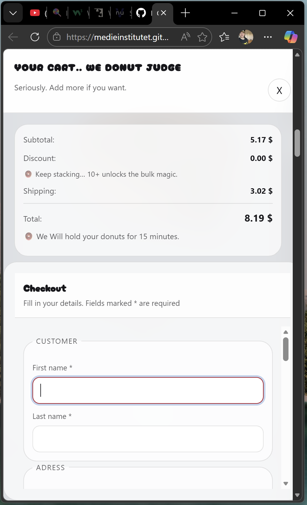

---

### Desktop:

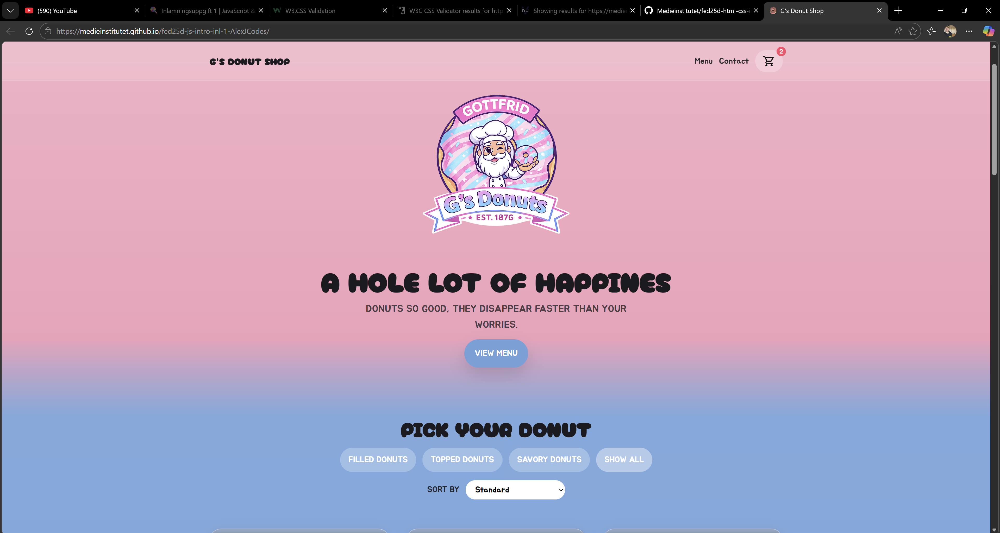

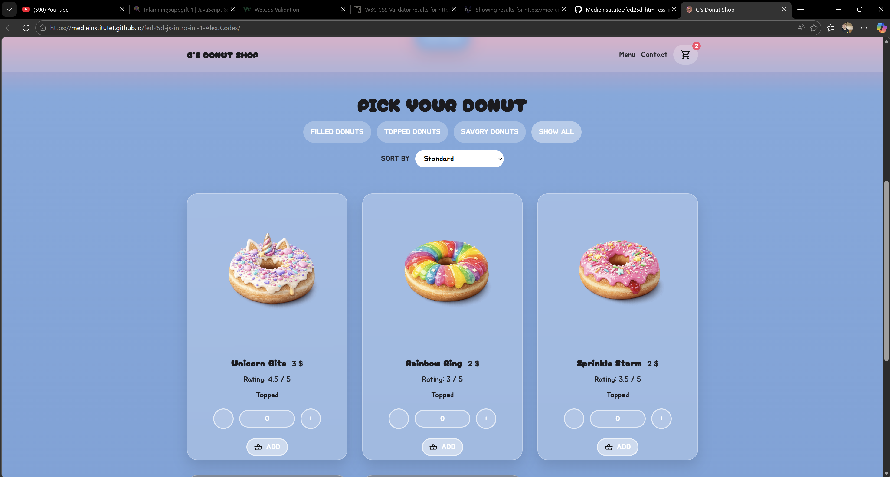

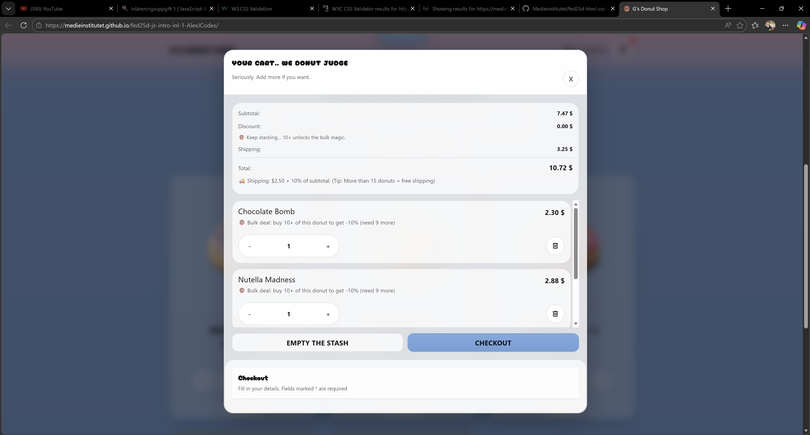

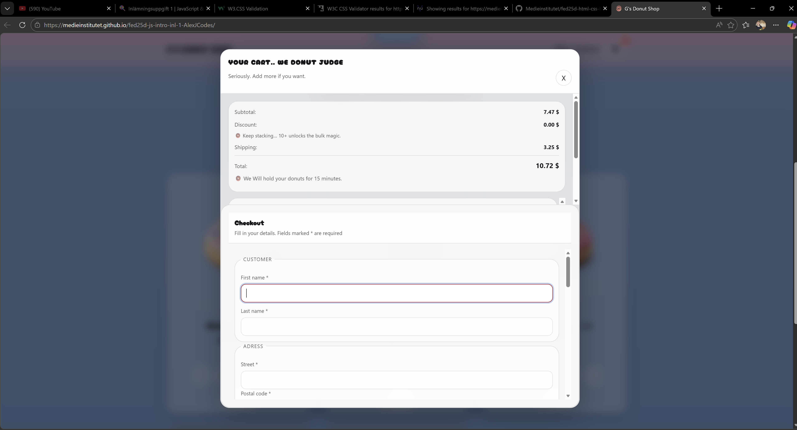

---

### Validators:

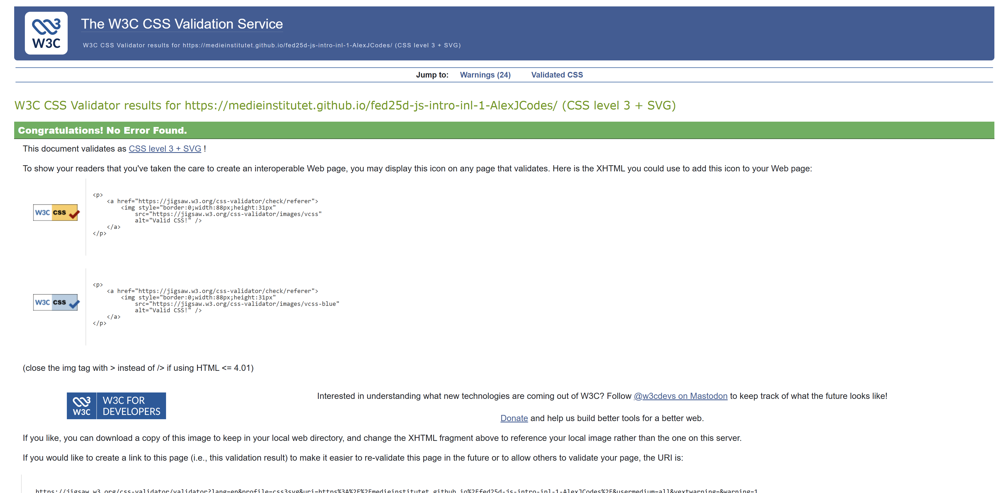

<b> Inga Errors för CSS </b>

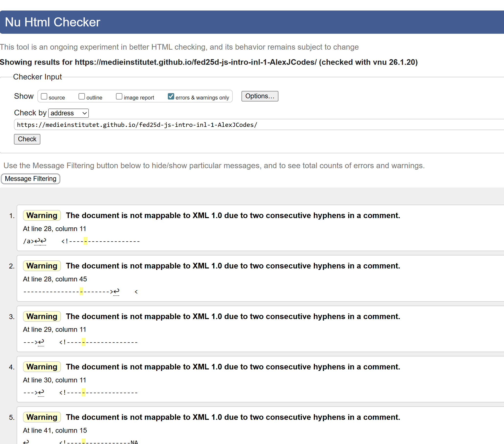

<b> Varningar finns för HTML, dock är det bara på kommentarer. </b>

---

### Lighthouse:

<b>Mobile:</b>    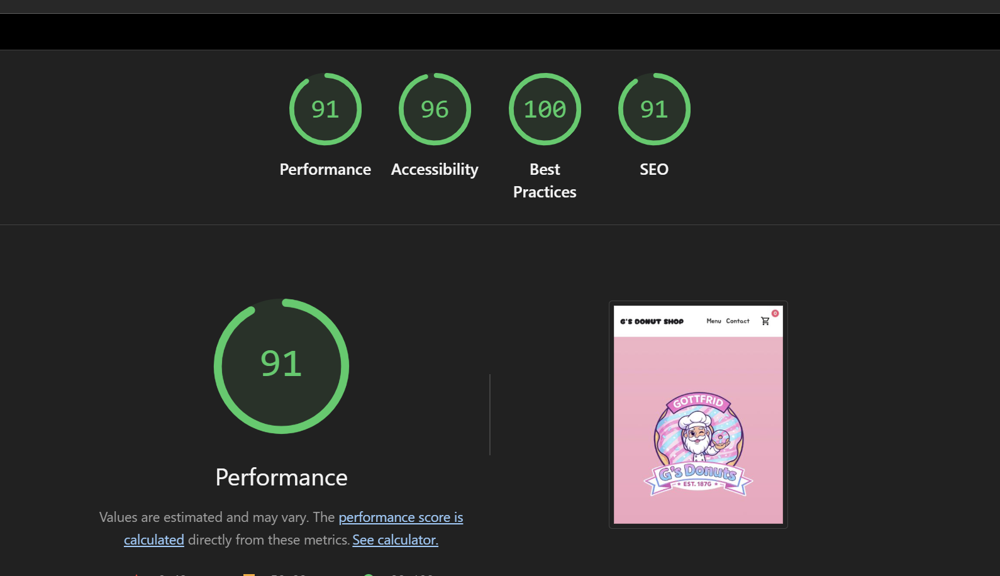

<b>Desktop:</b>    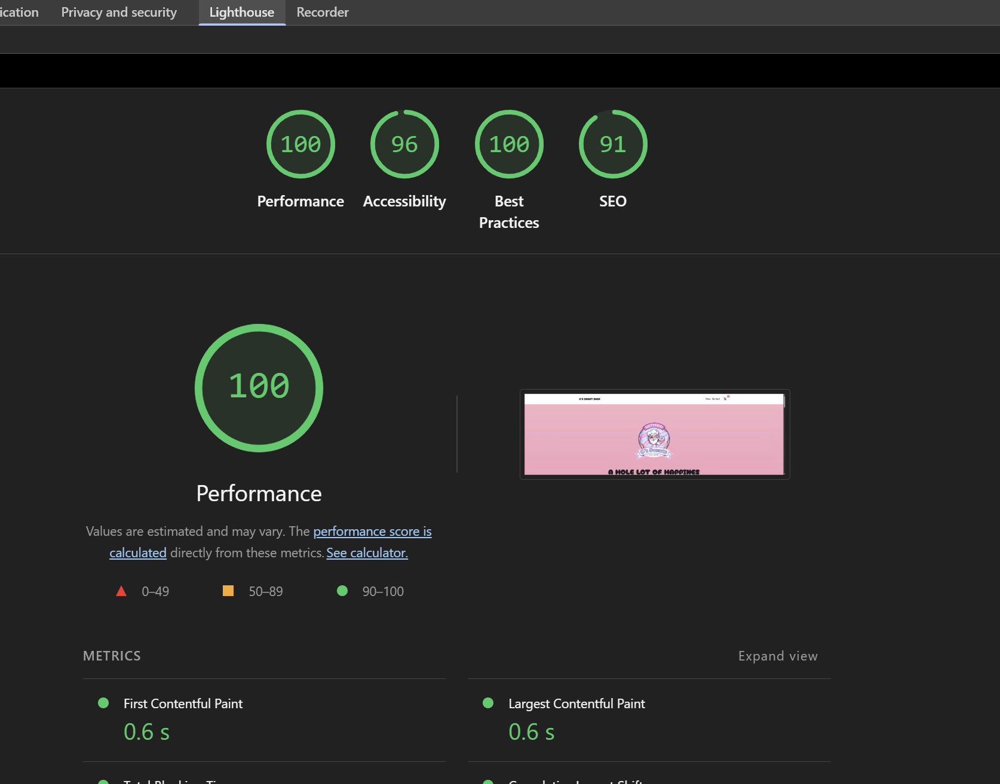

---

### Utmaningar

Den största utmaningen i projektet var att få ordning på struktur. Till en början så tyckte jag det var svårt att se och finna logik i koden, men desto mer jag suttit med det under projektet, desto mer logiskt har det blivit med JavaScript (Snälla inte fler språk nu ;D )   Som sagt i introduktionen så bestämde jag mig för att göra en omfattande mapp-struktur för JavaScript-koden. Det gjorde så att jag inte riktigt visste vart jag var. Hela projektet kändes nytt.. Koden var svår att hitta. Det tog otroligt lång tid för att hitta åter hitta synergi och tempo i arbetet.   Jag ångrar det inte då det istälet var hjälpsamt framåt slutet.

### Reflektion och framtidstänk

- Jag tar framförallt med mig att börja tidigt med en mappstruktur för JavaScript likt det jag tidigare gjort med SASS.
- Jag förstår varför "utvecklare" säger, <b>90% felsökning - 10% kodning.</b> Ändrar jag på något i min kod, då är det buggar någon annanstanns. Jag är helt säker på att människor som kodar har bäst tålamod i hela världen.
- Fokus på en sak i taget - framförallt när det kommer till JavaScript.
- Jag är otroligt glad att jag följde Jennis rekommendation om issues i GitHub och Pseudokod - Det har hjälpt mig <b>OTROLIGT</b> mycket att få en bättre struktur och arbetsflöde. Att ticka av något som är klart är en ganska kul känsla :)

### Kommentarer

- Jag har lagt in testers - om du skall prova måndagsrabatt / helgpåslag. Det ligger under orderSummary.js, högst upp i filen.    FORCERA måndag före 10.00 (For testing) const FORCE_MONDAY_DISCOUNT = false;  FORCERA helgpåslag 15% (For testing) const FORCE_WEEKEND_MARKUP = false;
- Timern har jag console.loggat -> funktionen funkar. För att testa satte jag timer på 5 sekunder -> Sidan återvänder till cart-menu med ett meddelande "You snooze you loose" 
- <b>OBS!</b> Jag har använt luhn algorithm. Mest för att jag va sjukt nyfiken på hur den funkar och agerar. Jag lade förmodligen allt för lång tid på att lära mig hur beräkningen fungerar, så jag kunde inte låta bli. Men basically så kommer du inte vidare utan ett giltligt personnummer i detta fall. Sorry ^.^ Hoppas det är Ok.  

Sist men inte minst! Ett STORT tack för ett roligt projekt!

<b>Länk till live-version:</b>  https://medieinstitutet.github.io/fed25d-js-intro-inl-1-AlexJCodes/
